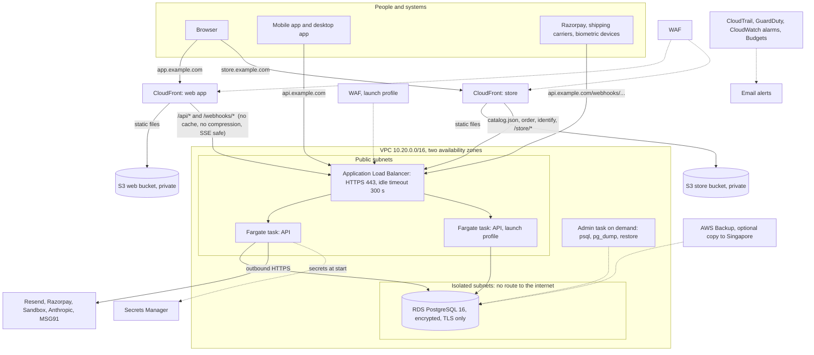

# Fintranzact on AWS (Mumbai): infrastructure as code

This folder explains the Terraform code in [`infra/`](../../infra/). The code
builds everything needed to run Fintranzact in AWS Mumbai (`ap-south-1`, so
customer data stays in India as CERT-In expects): the API with its PostgreSQL
database, the web app, and the online store site. It starts lean and grows by
changing variables, not by rewriting anything.

Nothing here has been applied yet: the AWS account does not exist. The code was
formatted, validated and plan-tested offline (see [Validation status](#validation-status)).

| Read this | When |
|---|---|
| [SETUP.md](SETUP.md) | First-time setup, step by step (start here) |
| [COST.md](COST.md) | What it costs, line by line, lean and launch |
| [OPERATIONS.md](OPERATIONS.md) | Deploys, rollbacks, scaling, logs, backups, secrets, upgrades |
| [MIGRATION-FROM-RAILWAY-VERCEL.md](MIGRATION-FROM-RAILWAY-VERCEL.md) | Moving the live data and traffic from Railway and Vercel |
| [SECURITY-NOTES.md](SECURITY-NOTES.md) | What the code enforces for the security checklist, and what it does not |

## The picture



The same picture as plain text:

```
Browser --> app.example.com   --> CloudFront --+--> S3 (web files)
                                               +--> /api/*, /webhooks/* ---------+
Browser --> store.example.com --> CloudFront --+--> S3 (store files)             |
                                               +--> catalog.json, order... ------+
Mobile / Razorpay / carriers --> api.example.com -------------------------------+
                                                                                 v
                                       ALB (HTTPS) --> Fargate API tasks --> RDS PostgreSQL (private)
```

## What each part is

| Part | Code | What it does |
|---|---|---|
| Network | `modules/network` | One VPC, two availability zones. Public subnets hold the load balancer and the API tasks (locked down by security groups). Isolated subnets hold only the database and have no route to the internet. Free S3 gateway endpoint. No NAT gateway unless you switch it on. VPC flow logs. |
| Database | `modules/database` | RDS PostgreSQL 16 in the isolated subnets. Encrypted with its own key, TLS forced, backups 14 to 35 days, deletion protection and a final snapshot, master password created and rotated by RDS inside Secrets Manager (Terraform never sees it). |
| API | `modules/api` | Container registry (ECR, scanned on push), ECS cluster, Fargate service, load balancer, secret containers, logs (180 days), alarms hooks, an on-demand admin task for database work. |
| Static sites | `modules/web` (used twice) | Private S3 bucket plus CloudFront for the web app and the store. Security headers, single-page-app fallback, long caching for hashed files and none for `index.html`. |
| Certificates and DNS | `modules/dns`, `modules/dns_records` | ACM certificates with DNS validation. Records are created for you with Route 53, or printed for you to add elsewhere. |
| WAF | `modules/waf` | Managed rule sets, a login rate limit, and exclusions so webhooks and large uploads are never blocked. |
| Security baseline | `modules/security` | CloudTrail, GuardDuty, S3 public-access block, CloudWatch alarms to your email, budgets with alerts at 50, 80 and 100 percent. Config and Security Hub are switches, off by default. |
| Backup | `modules/backup` | AWS Backup daily plan, optional copy to another region. |
| Bootstrap | `infra/bootstrap` | State bucket and lock table, the GitHub sign-in (OIDC) and the deploy role. Run once by you. |

## Decisions and trade-offs

**Fargate behind an Application Load Balancer.** The API is a long-running Node
server with streaming (server-sent events) answers, so it needs a real load
balancer with a long idle timeout. Fargate means no servers to patch, rolling
deploys with automatic rollback, and growth by changing `api_desired_count`.
Alternatives considered: *App Runner* (simpler but a hard request time limit that
fights the AI stream, and awkward private database access), *API Gateway + Lambda*
(30 s limit, the app is not built for it), *one EC2 or Lightsail box* (cheapest,
but you patch it, deploys cause downtime and one failure is an outage). The
price of the ALB is about 25 USD a month all in; that is the main reason this
design costs more than a single small server.

**No NAT gateway.** A NAT gateway costs about 40 USD a month. Instead, API tasks
get a public IP but their security group accepts traffic from the load balancer
only, so nothing on the internet can reach them directly. They still reach
Resend, Razorpay and Sandbox on their own. The database sits in subnets that have
no internet route at all. Switching `enable_nat_gateway = true` moves tasks to
private subnets without public IPs (more private, about 40 USD more). Each public
IPv4 address costs about 3.65 USD a month, which is part of the bill.

**Same-origin API through CloudFront, plus a direct API domain.** The web app
calls `/api/...` on its own domain (the same as the Vercel rewrite in
`apps/web/vercel.json`), so the session cookie stays first-party and CORS does not
matter for the browser. CloudFront forwards `/api/*` and `/webhooks/*` to the load
balancer. The mobile app, Razorpay and carriers use `api.example.com`, which is the
load balancer directly (the API's own address is also what the app prints in webhook
URLs: `API_URL`). The alternative, a browser calling `api.example.com` straight, would
need cross-site cookies and no code in the repo is set up for that.

**Streaming (AI answers).** `/api/ai/stream` has its own CloudFront behavior with
caching off, every header, cookie and query string forwarded, compression off, and
its own origin so its timeout can be raised later. The load balancer idle timeout is
300 s. CloudFront's default wait for a silent origin is 60 s (the quota maximum
without asking AWS); the stream sends data continuously, so this is fine. If an
answer ever stays silent for over a minute, ask AWS support to raise the "origin
response timeout" quota to 180 and set `sse_origin_read_timeout`.

**Store site.** The store lives at the root of its own domain
(`store.example.com/<shop>/catalog.json`) while the API serves it under `/store`.
Small CloudFront Functions add the `/store` prefix. The order page
(`/<shop>/order/<id>`) is both a page the browser opens and a JSON call; the same
rule as `apps/store/vite.config.ts` applies: a browser navigation (`Accept:
text/html`) is served by the app, everything else goes to the API. That one
function (`store_order`) switches origin inside CloudFront and could not be tested
without an AWS account: check it in the first smoke test (SETUP.md, step 14).

**WAF default.** Lean turns the CloudFront WAF on (about 10 USD a month) and the
load-balancer WAF off; launch turns both on. It is the cheapest control that stops
common attacks, bad IPs and password-guessing floods. The rules never touch
`/webhooks/*` or `/api/attendance/push`, and two body rules (`SizeRestrictions_BODY`,
`CrossSiteScripting_BODY`) only count, because the app sends large bodies
(logos, 300 KB attendance selfies, CSV and backup imports) and free text.

**Intel/x86 (default) versus Graviton (ARM64).** Graviton Fargate is about 20 percent
cheaper (roughly 4 USD a month at lean size), but GitHub's hosted runners are x86, so
an ARM image is built under emulation (QEMU), which is slow and has caught
native-module builds (`argon2`) out before. The default is `X86_64`. To switch, set
`api_cpu_architecture = "ARM64"` in Terraform and the repository variable
`AWS_API_ARCH=ARM64`, then deploy once. The database is Graviton (`db.t4g`)
either way.

**Migrations.** The migration runner already takes a PostgreSQL advisory lock, so two
containers starting together cannot migrate at once. Even so, running migrations
inside every starting container is slow and makes a failed migration look like a
crash loop. The deploy workflow therefore runs the migrations once, as a one-off ECS
task (`docker-entrypoint.sh migrate`), waits for it, and only then updates the
service. The service tasks run with `RUN_MIGRATIONS=false`. Both switches are new,
opt-in and leave Railway and docker-compose behavior unchanged.

**Terraform and the deploy workflow share the task definition.** Terraform writes
the task definition (CPU, memory, variables, secrets). The workflow starts from the
latest revision, swaps only the image, and points the service at it. Terraform
ignores the service's task definition afterwards, so it never rolls back a deploy.
A Terraform change to task settings takes effect at the next deploy.

**Staging.** `environment = "staging"` creates a second, separate copy with different
names. Staging must never receive real customer data (use made-up data only).
Account-wide pieces (GuardDuty, the S3 public-access block, CloudTrail) exist once per
account: in the same AWS account set `enable_guardduty = false`,
`enable_cloudtrail = false` for staging. A separate AWS account for staging is cleaner
and is recommended once you have revenue.

## Known limitations

- **Client IP and rate limits.** The API reads the last entry of `X-Forwarded-For`.
  Behind CloudFront and the load balancer that is a CloudFront address, not the
  visitor, so the app's per-IP limits (store orders, sign-in) see CloudFront's address
  for traffic that arrives through the web or store domain. Traffic on `api.example.com`
  (mobile, webhooks) is fine. This already exists today behind Vercel and Railway. The
  fix is a small application change (trust one more proxy hop); the WAF login rate limit
  at the edge uses the real visitor address and covers the most important case in the
  meantime.
- **Limits per task.** The app's rate limiters are in memory, so each API task counts
  separately.
- **Provider lock file.** `.terraform.lock.hcl` is not committed because it could not be
  generated here for all platforms; `terraform init` creates it on your computer (commit it
  then).

## Validation status

Checked offline with Terraform 1.9.8 and AWS provider 5.100.0: `terraform fmt -check
-recursive`, `terraform init -backend=false`, `terraform validate` (bootstrap and prod
stack), `terraform test` with mocked providers (plan-time wiring, three scenarios:
manual DNS before and after certificate validation, and a fully loaded launch profile
with Route 53), `tofu validate` with OpenTofu 1.8.5, `tflint` with the AWS ruleset,
`checkov` with a reviewed skip list (0 failures), `actionlint` on both workflows.

Not possible without an AWS account: a real `plan` or `apply`, the CloudFront order
page function, actual IAM permission sufficiency of the deploy role, live pricing. Plan
for one careful first apply with the owner watching, and read the `plan` output before
confirming.
